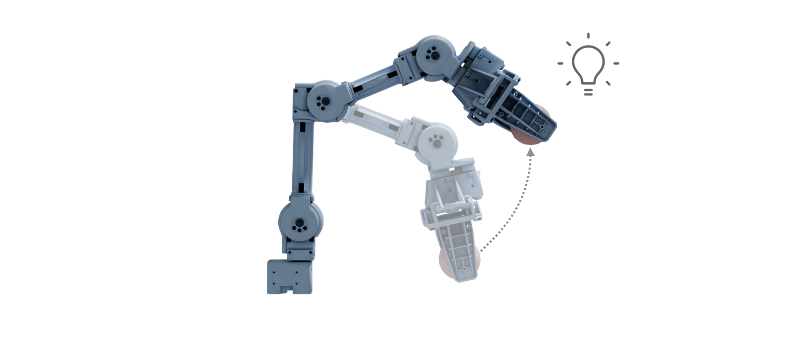

# Differentiable robot-object interaction for learning object properties



A framework that calibrates object properties through differentiable simulations of robot-object interactions.

A big shoutout to the [Nvidia Warp team](https://nvidia.github.io/warp/)! Warp integrates effortlessly with Torch, streamlining the use of differentiable simulation for Torch-based optimization workflows.

## Installation

Install the required packages first:

```
pip install -r requirements.txt
```

For visualization, install these optional packages:

- bpy
- blendertoolbox

and these softwares:

- Blender
- ffmpeg

## Usage

To calibrate object properties, use the following command:

```bash
python train.py --config-name hard_ball
```

To evaluate the calibrated object property, use the following command:``

```bash
python eval.py --config-name hard_ball ckpt=experiments/log/robotis_2_hard_ball/open_manipulator/open_manipulator_joint2_only_v2/train/training_stats.pt ckpt_idx=8
```

To visualize the robot, use the following command:

```bash
python render_usd.py --usd-path experiments/log/robotis_2_hard_ball/open_manipulator/open_manipulator_joint2_only_v2/test/test_ckpt_idx_0008.usd
```

## If this helps you, please consider citing the paper below.
```
@misc{chen2024learningobjectpropertiesusing,
      title={Learning Object Properties Using Robot Proprioception via Differentiable Robot-Object Interaction}, 
      author={Peter Yichen Chen and Chao Liu and Pingchuan Ma and John Eastman and Daniela Rus and Dylan Randle and Yuri Ivanov and Wojciech Matusik},
      year={2024},
      eprint={2410.03920},
      archivePrefix={arXiv},
      primaryClass={cs.RO},
      url={https://arxiv.org/abs/2410.03920}, 
}
```
